# Diagram sekwencji autentykacji - SimpleBudget

<authentication_analysis>

## 1. Przepływy autentykacji w aplikacji

### Rejestracja (Register)

- Użytkownik wypełnia formularz rejestracji (email, hasło, potwierdzenie hasła)
- Walidacja po stronie klienta (Zod schema)
- Żądanie POST do `/api/auth/register`
- Walidacja po stronie serwera (Zod schema)
- Utworzenie użytkownika w Supabase Auth (`signUp`)
- Przekierowanie na stronę logowania po sukcesie

### Logowanie (Login)

- Użytkownik wypełnia formularz logowania (email, hasło)
- Walidacja po stronie klienta (Zod schema)
- Żądanie POST do `/api/auth/login`
- Walidacja po stronie serwera (Zod schema)
- Autentykacja w Supabase Auth (`signInWithPassword`)
- Zwrot tokenów (access_token, refresh_token, expires_at)
- Przekierowanie do `/app`

### Wylogowanie (Logout)

- Żądanie POST do `/api/auth/logout` z tokenem Bearer
- Walidacja tokenu przez `getUser`
- Wylogowanie w Supabase Auth (`signOut` z scope: global)
- Przekierowanie na stronę logowania

### Dostęp do chronionych zasobów

- Sprawdzenie sesji w middleware (dla `/`)
- Sprawdzenie sesji w AppLayout (dla `/app/*`)
- Tokeny przekazywane do komponentów React przez props
- API endpoints wymagają nagłówka Authorization z Bearer token

## 2. Główni aktorzy i ich interakcje

- **Przeglądarka**: Komponenty React (formularze, hooki), przechowywanie tokenów
- **Middleware Astro**: Sprawdzanie sesji dla określonych ścieżek
- **Astro Pages/API**: Walidacja żądań, przekierowania, obsługa endpointów
- **Supabase Auth**: Zarządzanie użytkownikami, weryfikacja tokenów, sesje

## 3. Procesy weryfikacji tokenów

- Tokeny weryfikowane przez `supabase.auth.getUser(token)` w API endpoints
- Sesje sprawdzane przez `supabase.auth.getSession()` w stronach Astro
- AppLayout przekierowuje na `/login?sessionExpired=true` gdy brak sesji
- API endpoints zwracają 401 gdy token jest nieprawidłowy

## 4. Opis kroków autentykacji

1. Użytkownik wysyła dane logowania/rejestracji
2. Walidacja Zod po stronie klienta i serwera
3. Komunikacja z Supabase Auth
4. Zwrot tokenów lub błędu
5. Przekierowanie lub wyświetlenie błędu
6. Dostęp do chronionych zasobów z tokenem Bearer

```mermaid
sequenceDiagram
    autonumber

    participant Przeglądarka as Przeglądarka
    participant Middleware as Middleware Astro
    participant AstroAPI as Astro API
    participant SupabaseAuth as Supabase Auth

    Note over Przeglądarka,SupabaseAuth: Przepływ rejestracji

    Przeglądarka->>Przeglądarka: Walidacja formularza Zod
    Przeglądarka->>AstroAPI: POST /api/auth/register
    activate AstroAPI
    AstroAPI->>AstroAPI: Walidacja Zod serwer

    alt Błąd walidacji
        AstroAPI-->>Przeglądarka: 400 VALIDATION_ERROR
    else Dane poprawne
        AstroAPI->>SupabaseAuth: signUp(email, password)
        activate SupabaseAuth

        alt Email już zarejestrowany
            SupabaseAuth-->>AstroAPI: Błąd - email istnieje
            AstroAPI-->>Przeglądarka: 409 CONFLICT
        else Sukces rejestracji
            SupabaseAuth-->>AstroAPI: Dane użytkownika
            AstroAPI-->>Przeglądarka: 201 RegisterResponseDTO
            Przeglądarka->>Przeglądarka: Przekierowanie /login
        end
        deactivate SupabaseAuth
    end
    deactivate AstroAPI

    Note over Przeglądarka,SupabaseAuth: Przepływ logowania

    Przeglądarka->>Przeglądarka: Walidacja formularza Zod
    Przeglądarka->>AstroAPI: POST /api/auth/login
    activate AstroAPI
    AstroAPI->>AstroAPI: Walidacja Zod serwer

    alt Błąd walidacji
        AstroAPI-->>Przeglądarka: 400 VALIDATION_ERROR
    else Dane poprawne
        AstroAPI->>SupabaseAuth: signInWithPassword
        activate SupabaseAuth

        alt Nieprawidłowe dane logowania
            SupabaseAuth-->>AstroAPI: AuthApiError
            AstroAPI-->>Przeglądarka: 401 UNAUTHORIZED
        else Sukces logowania
            SupabaseAuth-->>AstroAPI: User + Session
            AstroAPI-->>Przeglądarka: 200 LoginResponseDTO
            Note right of Przeglądarka: access_token<br/>refresh_token<br/>expires_at
            Przeglądarka->>Przeglądarka: Przekierowanie /app
        end
        deactivate SupabaseAuth
    end
    deactivate AstroAPI

    Note over Przeglądarka,SupabaseAuth: Dostęp do chronionych stron

    Przeglądarka->>Middleware: GET /app/*
    activate Middleware
    Middleware->>SupabaseAuth: getSession()
    activate SupabaseAuth
    SupabaseAuth-->>Middleware: Session lub null
    deactivate SupabaseAuth

    alt Brak sesji
        Middleware-->>Przeglądarka: Redirect /login?sessionExpired
    else Sesja aktywna
        Middleware-->>Przeglądarka: Strona z accessToken w props
    end
    deactivate Middleware

    Note over Przeglądarka,SupabaseAuth: Dostęp do chronionego API

    Przeglądarka->>AstroAPI: GET /api/* + Bearer token
    activate AstroAPI
    AstroAPI->>AstroAPI: Ekstrakcja tokenu z nagłówka

    alt Brak nagłówka Authorization
        AstroAPI-->>Przeglądarka: 401 UNAUTHORIZED
    else Token obecny
        AstroAPI->>SupabaseAuth: getUser(token)
        activate SupabaseAuth

        alt Token nieprawidłowy/wygasły
            SupabaseAuth-->>AstroAPI: Błąd weryfikacji
            AstroAPI-->>Przeglądarka: 401 UNAUTHORIZED
            Przeglądarka->>Przeglądarka: Redirect /login?sessionExpired
        else Token prawidłowy
            SupabaseAuth-->>AstroAPI: Dane użytkownika
            AstroAPI-->>Przeglądarka: 200 Dane zasobu
        end
        deactivate SupabaseAuth
    end
    deactivate AstroAPI

    Note over Przeglądarka,SupabaseAuth: Przepływ wylogowania

    Przeglądarka->>AstroAPI: POST /api/auth/logout + Bearer
    activate AstroAPI
    AstroAPI->>SupabaseAuth: getUser(token)
    activate SupabaseAuth

    alt Token nieprawidłowy
        SupabaseAuth-->>AstroAPI: Błąd weryfikacji
        AstroAPI-->>Przeglądarka: 401 UNAUTHORIZED
    else Token prawidłowy
        SupabaseAuth-->>AstroAPI: Dane użytkownika
        AstroAPI->>SupabaseAuth: signOut(scope: global)
        SupabaseAuth-->>AstroAPI: Sukces wylogowania
        AstroAPI-->>Przeglądarka: 200 LogoutResponseDTO
        Przeglądarka->>Przeglądarka: Redirect /login
    end
    deactivate SupabaseAuth
    deactivate AstroAPI

    Note over Przeglądarka,SupabaseAuth: Obsługa wygaśnięcia tokenu

    Przeglądarka->>AstroAPI: Żądanie z wygasłym tokenem
    activate AstroAPI
    AstroAPI->>SupabaseAuth: getUser(wygasły_token)
    activate SupabaseAuth
    SupabaseAuth-->>AstroAPI: Błąd - token wygasły
    deactivate SupabaseAuth
    AstroAPI-->>Przeglądarka: 401 UNAUTHORIZED
    deactivate AstroAPI
    Przeglądarka->>Przeglądarka: Redirect /login?sessionExpired

    Note over Przeglądarka: Użytkownik musi zalogować<br/>się ponownie
```

</authentication_analysis>

<mermaid_diagram>

</mermaid_diagram>

## Opis przepływów

### Rejestracja

1. Użytkownik wypełnia formularz rejestracji
2. Walidacja Zod po stronie klienta (email, hasło min 8 znaków, potwierdzenie)
3. Żądanie POST do `/api/auth/register`
4. Walidacja Zod po stronie serwera
5. Supabase Auth tworzy użytkownika
6. Przekierowanie na `/login`

### Logowanie

1. Użytkownik wypełnia formularz logowania
2. Walidacja Zod po stronie klienta
3. Żądanie POST do `/api/auth/login`
4. Supabase Auth weryfikuje dane i zwraca sesję
5. Zwrot `access_token`, `refresh_token`, `expires_at`
6. Przekierowanie do `/app`

### Dostęp do chronionych zasobów

1. **Strony Astro** (`/app/*`): AppLayout sprawdza sesję przez `getSession()`
2. **API endpoints**: Wymagają nagłówka `Authorization: Bearer <token>`
3. Weryfikacja tokenu przez `getUser(token)`
4. Brak/wygasły token = 401 + redirect do `/login`

### Wylogowanie

1. Żądanie POST do `/api/auth/logout` z tokenem Bearer
2. Weryfikacja tokenu
3. Supabase `signOut` z `scope: global` (wylogowanie ze wszystkich urządzeń)
4. Przekierowanie na `/login`

### Obsługa wygaśnięcia tokenu

1. Żądanie z wygasłym tokenem zwraca 401
2. Klient wykrywa 401 i przekierowuje na `/login?sessionExpired=true`
3. Użytkownik musi zalogować się ponownie

## Uwagi bezpieczeństwa

- Generyczne komunikaty błędów (zapobiega enumeracji użytkowników)
- Walidacja Zod po stronie klienta i serwera
- Tokeny przekazywane przez props do komponentów React
- Global signOut wylogowuje ze wszystkich sesji
