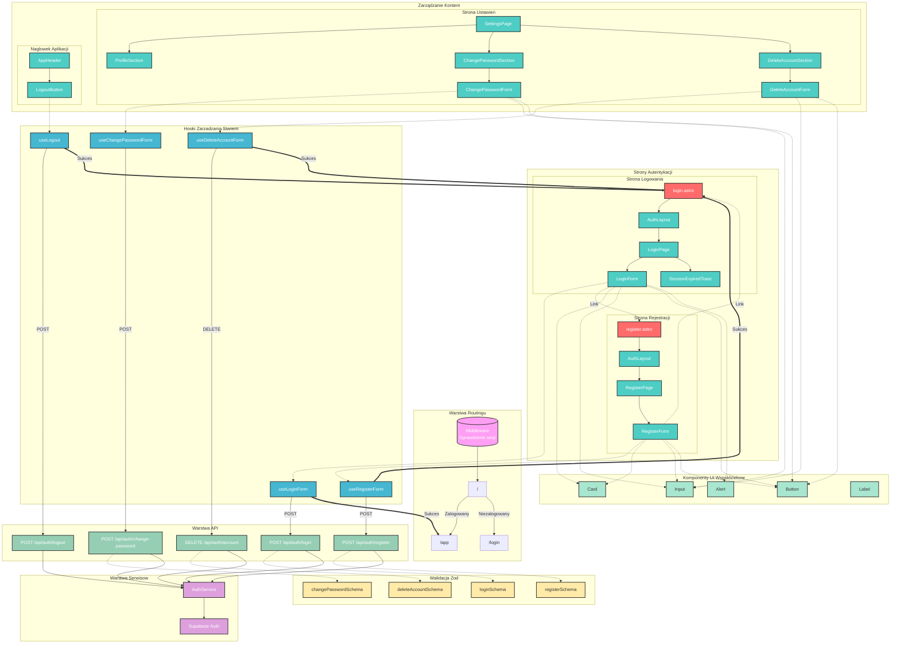

# Diagram Architektury UI - Moduł Autentykacji

<architecture_analysis>

## 1. Lista komponentów w module autentykacji

### Strony Astro
- `/src/pages/login.astro` - Strona logowania
- `/src/pages/register.astro` - Strona rejestracji

### Layouty
- `/src/layouts/AuthLayout.astro` - Layout dla stron autentykacji (logowanie, rejestracja)
- `/src/layouts/Layout.astro` - Bazowy layout aplikacji

### Komponenty React - Strony
- `LoginPage.tsx` - Kontener strony logowania z obsługą wygaśnięcia sesji
- `RegisterPage.tsx` - Kontener strony rejestracji
- `SettingsPage.tsx` - Strona ustawień (zawiera sekcje zmiany hasła i usunięcia konta)

### Komponenty React - Formularze
- `LoginForm.tsx` - Formularz logowania z polami email i hasło
- `RegisterForm.tsx` - Formularz rejestracji z polami email, hasło i potwierdzenie hasła
- `ChangePasswordForm.tsx` - Formularz zmiany hasła
- `DeleteAccountForm.tsx` - Formularz usunięcia konta

### Komponenty React - Sekcje i pomocnicze
- `SessionExpiredToast.tsx` - Powiadomienie o wygaśnięciu sesji
- `ChangePasswordSection.tsx` - Sekcja karty zmiany hasła
- `DeleteAccountSection.tsx` - Sekcja karty usunięcia konta
- `ProfileSection.tsx` - Sekcja profilu użytkownika
- `LogoutButton.tsx` - Przycisk wylogowania w nagłówku

### Hooki React (zarządzanie stanem)
- `useLoginForm.ts` - Stan i logika formularza logowania
- `useRegisterForm.ts` - Stan i logika formularza rejestracji
- `useLogout.ts` - Logika wylogowania
- `useChangePasswordForm.ts` - Stan i logika formularza zmiany hasła
- `useDeleteAccountForm.ts` - Stan i logika formularza usunięcia konta

### Schematy walidacji (Zod)
- `registerSchema` - Walidacja danych rejestracji
- `loginSchema` - Walidacja danych logowania
- `changePasswordSchema` - Walidacja danych zmiany hasła
- `deleteAccountSchema` - Walidacja potwierdzenia usunięcia konta

### Endpointy API
- `POST /api/auth/register` - Rejestracja użytkownika
- `POST /api/auth/login` - Logowanie użytkownika
- `POST /api/auth/logout` - Wylogowanie użytkownika
- `POST /api/auth/change-password` - Zmiana hasła
- `DELETE /api/auth/account` - Usunięcie konta

### Serwisy
- `AuthService` - Serwis autentykacji (register, login, logout, changePassword, deleteAccount)

### Middleware
- `onRequest` - Middleware Astro sprawdzający sesję i przekierowujący na odpowiednią stronę

### Komponenty UI (Shadcn/ui)
- `Card`, `CardContent`, `CardHeader`, `CardTitle`, `CardDescription`
- `Input`, `Label`, `Button`
- `Alert`, `AlertDescription`

## 2. Główne strony i odpowiadające komponenty

### Strona Logowania (`/login`)
- login.astro → AuthLayout → LoginPage → LoginForm
- Obsługuje: wygaśnięcie sesji (SessionExpiredToast)
- Hook: useLoginForm
- API: POST /api/auth/login

### Strona Rejestracji (`/register`)
- register.astro → AuthLayout → RegisterPage → RegisterForm
- Hook: useRegisterForm
- API: POST /api/auth/register

### Strona Ustawień (`/app/settings`) - powiązana z auth
- SettingsPage → ProfileSection, ChangePasswordSection, DeleteAccountSection
- ChangePasswordSection → ChangePasswordForm
- DeleteAccountSection → DeleteAccountForm
- Hooki: useChangePasswordForm, useDeleteAccountForm
- API: POST /api/auth/change-password, DELETE /api/auth/account

### Nagłówek aplikacji (wylogowanie)
- AppHeader → LogoutButton
- Hook: useLogout
- API: POST /api/auth/logout

## 3. Przepływ danych między komponentami

### Logowanie
1. LoginForm zbiera dane → useLoginForm waliduje lokalnie
2. useLoginForm wysyła POST /api/auth/login
3. API waliduje przez loginSchema → AuthService.login()
4. Sukces: przekierowanie do /app
5. Błąd: wyświetlenie komunikatu w formularzu

### Rejestracja
1. RegisterForm zbiera dane → useRegisterForm waliduje lokalnie
2. useRegisterForm wysyła POST /api/auth/register
3. API waliduje przez registerSchema → AuthService.register()
4. Sukces: przekierowanie do /login
5. Błąd: wyświetlenie komunikatu (np. email zajęty)

### Wylogowanie
1. LogoutButton → useLogout
2. useLogout wysyła POST /api/auth/logout z tokenem
3. API wywołuje AuthService.logout()
4. Sukces: przekierowanie do /login

### Zmiana hasła
1. ChangePasswordForm → useChangePasswordForm
2. Hook wysyła POST /api/auth/change-password z tokenem
3. API waliduje przez changePasswordSchema → AuthService.changePassword()
4. Sukces: toast z potwierdzeniem

### Usunięcie konta
1. DeleteAccountForm → useDeleteAccountForm
2. Hook wysyła DELETE /api/auth/account z tokenem
3. API waliduje przez deleteAccountSchema → AuthService.deleteAccount()
4. Sukces: przekierowanie do /login

## 4. Opis funkcjonalności komponentów

### Strony Astro
- **login.astro**: Renderuje stronę logowania, przekazuje parametr sessionExpired
- **register.astro**: Renderuje stronę rejestracji

### Layouty
- **AuthLayout**: Centruje formularz na ekranie, stosuje ciemne tło
- **Layout**: Bazowy layout z meta tagami

### Komponenty stron
- **LoginPage**: Zarządza wyświetlaniem toastu o wygaśnięciu sesji
- **RegisterPage**: Prosty kontener dla formularza rejestracji
- **SettingsPage**: Organizuje sekcje ustawień konta

### Formularze
- **LoginForm**: Pola email/hasło, walidacja, link do rejestracji
- **RegisterForm**: Pola email/hasło/potwierdzenie, walidacja, link do logowania
- **ChangePasswordForm**: Pola aktualne hasło/nowe hasło/potwierdzenie
- **DeleteAccountForm**: Pole potwierdzenia (wpisz DELETE)

### Pomocnicze
- **SessionExpiredToast**: Automatycznie znika po 5 sekundach
- **LogoutButton**: Pokazuje spinner podczas wylogowania

### Hooki
- Wszystkie hooki zarządzają: stanem formularza, błędami, walidacją, wysyłaniem requestów

### Serwis
- **AuthService**: Komunikacja z Supabase Auth API

### Middleware
- Sprawdza sesję przy wejściu na /
- Przekierowuje zalogowanych do /app, niezalogowanych do /login

</architecture_analysis>

<mermaid_diagram>

</mermaid_diagram>

## Legenda

| Kolor | Typ komponentu |
|-------|----------------|
| Czerwony | Strony Astro |
| Turkusowy | Komponenty React |
| Niebieski | Hooki React |
| Zielony | Endpointy API |
| Fioletowy | Serwisy |
| Żółty | Schematy walidacji Zod |
| Jasnozielony | Komponenty UI (Shadcn) |
| Różowy | Middleware |

## Typy połączeń

| Typ linii | Znaczenie |
|-----------|-----------|
| `-->` | Renderowanie / Zawieranie |
| `-.->` | Użycie / Zależność |
| `==>` | Przekierowanie po akcji |
