# Diagram podróży użytkownika - Moduł autentykacji SimpleBudget

<user_journey_analysis>

## 1. Ścieżki użytkownika zidentyfikowane w dokumentacji

### Wymagania z PRD:
- **US-001**: Rejestracja konta (email, hasło, powtórzenie hasła)
- **US-002**: Logowanie do aplikacji (email, hasło)
- **US-003**: Wylogowanie z aplikacji
- **US-004**: Kontrola dostępu do danych użytkownika
- **US-005**: Zmiana hasła (aktualne hasło + nowe hasło x2)
- **US-006**: Usunięcie konta (z potwierdzeniem "DELETE")

### Dodatkowe przepływy z implementacji:
- Dostęp do strony głównej (`/`) z przekierowaniem w zależności od sesji
- Dostęp do chronionych stron (`/app/*`) - wymaga aktywnej sesji
- Obsługa wygaśnięcia sesji - toast informacyjny
- Obsługa błędów walidacji formularzy

## 2. Główne podróże użytkownika

### A. Nowy użytkownik (rejestracja)
- Wejście na stronę główną
- Przejście do formularza rejestracji
- Walidacja danych (email, hasło 8+ znaków, potwierdzenie)
- Sukces → przekierowanie do logowania
- Błąd → powrót do formularza z komunikatem

### B. Istniejący użytkownik (logowanie)
- Wypełnienie formularza logowania
- Walidacja danych
- Sukces → przekierowanie do aplikacji (`/app`)
- Błąd → generyczny komunikat (bez ujawniania czy email istnieje)

### C. Zalogowany użytkownik (zarządzanie kontem)
- Dostęp do panelu aplikacji
- Możliwość zmiany hasła (wymaga aktualnego hasła)
- Możliwość usunięcia konta (wymaga potwierdzenia "DELETE")
- Wylogowanie (globalne - ze wszystkich urządzeń)

### D. Obsługa sesji
- Automatyczne sprawdzanie ważności sesji
- Wygaśnięcie → przekierowanie do logowania z komunikatem
- Odświeżanie tokenów (obsługiwane przez Supabase)

## 3. Punkty decyzyjne

### Rejestracja:
- Email już zarejestrowany → błąd konfliktu
- Hasła różne → błąd walidacji
- Hasło za krótkie (<8 znaków) → błąd walidacji

### Logowanie:
- Nieprawidłowe dane → generyczny komunikat błędu
- Sesja wygasła → toast informacyjny

### Zmiana hasła:
- Złe aktualne hasło → błąd autoryzacji
- Nowe hasło = aktualne → błąd walidacji
- Hasła nie pasują → błąd walidacji

### Usunięcie konta:
- Brak potwierdzenia "DELETE" → formularz zablokowany
- Sukces → wylogowanie, usunięcie wszystkich danych, przekierowanie

```mermaid
stateDiagram-v2
    [*] --> StronaGlowna

    state "Strona główna" as StronaGlowna {
        [*] --> SprawdzenieSesji

        state if_sesja <<choice>>
        SprawdzenieSesji --> if_sesja
        if_sesja --> PrzekierowanieDoAplikacji: Sesja aktywna
        if_sesja --> WyborAkcji: Brak sesji

        state "Wybór akcji" as WyborAkcji
        note right of WyborAkcji
            Użytkownik może wybrać:
            - Zaloguj się
            - Utwórz konto
        end note
    }

    state "Proces rejestracji" as Rejestracja {
        [*] --> FormularzRejestracji

        state "Formularz rejestracji" as FormularzRejestracji
        note right of FormularzRejestracji
            Pola formularza:
            - E-mail
            - Hasło (min. 8 znaków)
            - Powtórz hasło
        end note

        FormularzRejestracji --> WalidacjaRejestracji: Kliknięcie Utwórz konto

        state "Walidacja danych" as WalidacjaRejestracji

        state if_walidacja_rej <<choice>>
        WalidacjaRejestracji --> if_walidacja_rej

        if_walidacja_rej --> BladWalidacjiRejestracji: Dane niepoprawne
        if_walidacja_rej --> WyslanieRejestracji: Dane poprawne

        state "Błąd walidacji" as BladWalidacjiRejestracji
        note right of BladWalidacjiRejestracji
            Możliwe błędy:
            - Nieprawidłowy format e-mail
            - Hasło za krótkie
            - Hasła nie są identyczne
        end note
        BladWalidacjiRejestracji --> FormularzRejestracji

        state "Wysyłanie żądania" as WyslanieRejestracji

        state if_odpowiedz_rej <<choice>>
        WyslanieRejestracji --> if_odpowiedz_rej

        if_odpowiedz_rej --> EmailZajety: Email już istnieje
        if_odpowiedz_rej --> RejestracjaUdana: Sukces

        state "Email zajęty" as EmailZajety
        note right of EmailZajety
            Komunikat:
            Ten adres e-mail jest
            już zarejestrowany
        end note
        EmailZajety --> FormularzRejestracji

        state "Rejestracja udana" as RejestracjaUdana
    }

    state "Proces logowania" as Logowanie {
        [*] --> FormularzLogowania

        state "Formularz logowania" as FormularzLogowania
        note right of FormularzLogowania
            Pola formularza:
            - E-mail
            - Hasło

            Opcjonalnie:
            Toast sesja wygasła
        end note

        FormularzLogowania --> WalidacjaLogowania: Kliknięcie Zaloguj

        state "Walidacja danych" as WalidacjaLogowania

        state if_walidacja_log <<choice>>
        WalidacjaLogowania --> if_walidacja_log

        if_walidacja_log --> BladWalidacjiLogowania: Dane niepoprawne
        if_walidacja_log --> WyslanieLogowania: Dane poprawne

        state "Błąd walidacji" as BladWalidacjiLogowania
        BladWalidacjiLogowania --> FormularzLogowania

        state "Wysyłanie żądania" as WyslanieLogowania

        state if_odpowiedz_log <<choice>>
        WyslanieLogowania --> if_odpowiedz_log

        if_odpowiedz_log --> BladLogowania: Nieprawidłowe dane
        if_odpowiedz_log --> LogowanieUdane: Sukces

        state "Błąd logowania" as BladLogowania
        note right of BladLogowania
            Generyczny komunikat:
            Nieprawidłowe dane logowania
            (bez ujawniania czy email istnieje)
        end note
        BladLogowania --> FormularzLogowania

        state "Logowanie udane" as LogowanieUdane
    }

    state "Panel aplikacji" as PanelAplikacji {
        [*] --> WidokGlowny

        state "Widok główny" as WidokGlowny
        note right of WidokGlowny
            Dostęp do:
            - Transakcje
            - Kategorie
            - Podsumowanie
            - Ustawienia
        end note

        WidokGlowny --> UstawieniaKonta: Przejście do ustawień
        WidokGlowny --> PoczatekWylogowania: Kliknięcie wyloguj

        state "Ustawienia konta" as UstawieniaKonta {
            [*] --> ProfilUzytkownika

            state "Profil użytkownika" as ProfilUzytkownika
            note right of ProfilUzytkownika
                Wyświetla:
                - E-mail (tylko odczyt)
            end note

            ProfilUzytkownika --> ProcesZmianyHasla: Zmiana hasła
            ProfilUzytkownika --> ProcesUsunieciaKonta: Usunięcie konta

            state "Zmiana hasła" as ProcesZmianyHasla {
                [*] --> FormularzZmianyHasla

                state "Formularz zmiany hasła" as FormularzZmianyHasla
                note right of FormularzZmianyHasla
                    Pola:
                    - Aktualne hasło
                    - Nowe hasło (min. 8 znaków)
                    - Powtórz nowe hasło
                end note

                FormularzZmianyHasla --> WalidacjaZmianyHasla: Kliknięcie Zmień hasło

                state if_zmiana_hasla <<choice>>
                WalidacjaZmianyHasla --> if_zmiana_hasla

                if_zmiana_hasla --> BladZmianyHasla: Walidacja nieudana
                if_zmiana_hasla --> WyslanieZmianyHasla: Walidacja OK

                state "Błąd walidacji" as BladZmianyHasla
                note right of BladZmianyHasla
                    Możliwe błędy:
                    - Hasło za krótkie
                    - Hasła różne
                    - Nowe = aktualne
                end note
                BladZmianyHasla --> FormularzZmianyHasla

                WyslanieZmianyHasla --> if_odpowiedz_zmiana

                state if_odpowiedz_zmiana <<choice>>

                if_odpowiedz_zmiana --> BladAktualnegoHasla: Złe aktualne hasło
                if_odpowiedz_zmiana --> ZmianaHaslaUdana: Sukces

                state "Błąd autoryzacji" as BladAktualnegoHasla
                note right of BladAktualnegoHasla
                    Komunikat:
                    Aktualne hasło jest
                    niepoprawne
                end note
                BladAktualnegoHasla --> FormularzZmianyHasla

                state "Zmiana udana" as ZmianaHaslaUdana
                note right of ZmianaHaslaUdana
                    Toast z potwierdzeniem
                    Reset formularza
                end note
            }

            state "Usunięcie konta" as ProcesUsunieciaKonta {
                [*] --> OstrzezenieUsunieciaKonta

                state "Ostrzeżenie" as OstrzezenieUsunieciaKonta
                note right of OstrzezenieUsunieciaKonta
                    Uwaga: Usunięcie konta
                    jest nieodwracalne.
                    Wszystkie dane zostaną
                    trwale usunięte.
                end note

                OstrzezenieUsunieciaKonta --> FormularzUsunieciaKonta

                state "Formularz potwierdzenia" as FormularzUsunieciaKonta
                note right of FormularzUsunieciaKonta
                    Pole:
                    - Wpisz DELETE aby potwierdzić
                end note

                FormularzUsunieciaKonta --> if_potwierdzenie_delete

                state if_potwierdzenie_delete <<choice>>

                if_potwierdzenie_delete --> BladPotwierdzenia: Tekst != DELETE
                if_potwierdzenie_delete --> WyslanieUsunieciaKonta: Tekst = DELETE

                state "Błąd potwierdzenia" as BladPotwierdzenia
                BladPotwierdzenia --> FormularzUsunieciaKonta

                state "Usuwanie konta" as WyslanieUsunieciaKonta
                note right of WyslanieUsunieciaKonta
                    Trwałe usunięcie:
                    - Profil użytkownika
                    - Wszystkie kategorie
                    - Wszystkie transakcje
                end note

                WyslanieUsunieciaKonta --> KontoUsuniete

                state "Konto usunięte" as KontoUsuniete
            }

            ProcesZmianyHasla --> ProfilUzytkownika: Powrót
            ZmianaHaslaUdana --> ProfilUzytkownika
        }

        UstawieniaKonta --> WidokGlowny: Powrót
    }

    state "Wylogowanie" as ProcesWylogowania {
        [*] --> PoczatekWylogowania

        state "Inicjalizacja wylogowania" as PoczatekWylogowania
        PoczatekWylogowania --> WyslanieWylogowania

        state "Wysyłanie żądania" as WyslanieWylogowania
        note right of WyslanieWylogowania
            Wylogowanie globalne
            ze wszystkich urządzeń
        end note

        WyslanieWylogowania --> WylogowanieUdane

        state "Wylogowanie udane" as WylogowanieUdane
        note right of WylogowanieUdane
            Czyszczenie tokenów
            Przekierowanie do logowania
        end note
    }

    state "Obsługa wygaśnięcia sesji" as ObslugaSesji {
        [*] --> SesjaWygasla

        state "Sesja wygasła" as SesjaWygasla
        note right of SesjaWygasla
            Wykrycie podczas:
            - Żądania API (401)
            - Sprawdzenia middleware
        end note

        SesjaWygasla --> PrzekierowanieSesjaWygasla

        state "Przekierowanie" as PrzekierowanieSesjaWygasla
        note right of PrzekierowanieSesjaWygasla
            Redirect do:
            /login?sessionExpired=true

            Toast: Sesja wygasła.
            Zaloguj się ponownie.
        end note
    }

    WyborAkcji --> Rejestracja: Utwórz konto
    WyborAkcji --> Logowanie: Zaloguj się

    RejestracjaUdana --> Logowanie

    LogowanieUdane --> PrzekierowanieDoAplikacji

    state "Przekierowanie do aplikacji" as PrzekierowanieDoAplikacji

    PrzekierowanieDoAplikacji --> PanelAplikacji

    KontoUsuniete --> Logowanie
    WylogowanieUdane --> Logowanie
    PrzekierowanieSesjaWygasla --> Logowanie

    FormularzLogowania --> Rejestracja: Link Utwórz konto
    FormularzRejestracji --> Logowanie: Link Mam konto
```

</user_journey_analysis>

<mermaid_diagram>

</mermaid_diagram>

## Opis przepływów

### 1. Wejście do aplikacji
Użytkownik wchodzi na stronę główną. System sprawdza, czy istnieje aktywna sesja:
- **Sesja aktywna** → automatyczne przekierowanie do panelu aplikacji (`/app`)
- **Brak sesji** → wyświetlenie strony z opcjami logowania lub rejestracji

### 2. Rejestracja nowego konta
1. Użytkownik wypełnia formularz rejestracji (e-mail, hasło, potwierdzenie hasła)
2. Walidacja po stronie klienta (format e-mail, hasło min. 8 znaków, zgodność haseł)
3. Wysłanie żądania do API
4. Możliwe scenariusze:
   - **Sukces** → przekierowanie do formularza logowania
   - **Email zajęty** → komunikat o konflikcie
   - **Błąd walidacji** → wyświetlenie szczegółów błędu

### 3. Logowanie
1. Użytkownik wypełnia formularz logowania (e-mail, hasło)
2. Walidacja po stronie klienta
3. Wysłanie żądania do API
4. Możliwe scenariusze:
   - **Sukces** → zapisanie tokenów, przekierowanie do `/app`
   - **Błąd** → generyczny komunikat "Nieprawidłowe dane logowania"

### 4. Zarządzanie kontem (Ustawienia)
Zalogowany użytkownik ma dostęp do ustawień konta:

#### Zmiana hasła
1. Formularz z trzema polami (aktualne hasło, nowe hasło, potwierdzenie)
2. Walidacja: min. 8 znaków, zgodność haseł, różne od aktualnego
3. Weryfikacja aktualnego hasła przez serwer
4. Sukces → toast z potwierdzeniem, reset formularza

#### Usunięcie konta
1. Ostrzeżenie o nieodwracalności operacji
2. Pole potwierdzenia - wymaga wpisania "DELETE"
3. Sukces → usunięcie wszystkich danych, wylogowanie, przekierowanie

### 5. Wylogowanie
1. Kliknięcie "Wyloguj" w aplikacji
2. Żądanie do API z globalnym scope (wylogowanie ze wszystkich urządzeń)
3. Wyczyszczenie tokenów
4. Przekierowanie do formularza logowania

### 6. Obsługa wygaśnięcia sesji
1. Wykrycie wygasłego tokenu podczas żądania API (401) lub sprawdzenia middleware
2. Przekierowanie do `/login?sessionExpired=true`
3. Wyświetlenie toastu informującego o wygaśnięciu sesji

## Uwagi bezpieczeństwa

- **Generyczne komunikaty błędów** - system nie ujawnia, czy dany e-mail istnieje w bazie
- **Walidacja dwustronna** - zarówno po stronie klienta, jak i serwera
- **Globalne wylogowanie** - wylogowanie ze wszystkich urządzeń jednocześnie
- **Potwierdzenie usunięcia** - wymaga jawnego wpisania "DELETE"
- **Minimalna długość hasła** - 8 znaków zgodnie z wymaganiami MVP
